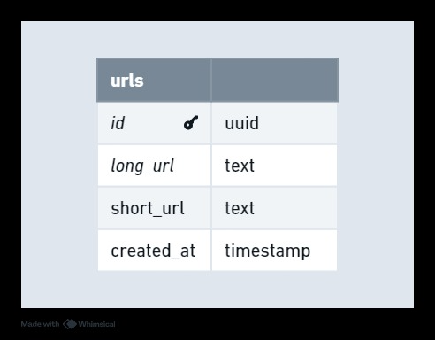

# URL Shortener - Technical Documentation

The **URL Shortener** is a simple yet powerful tool designed to make long URLs shorter and easier to share. With just a few clicks, users can create compact links that redirect seamlessly to their original destinations.

The project focuses on delivering a fast and reliable experience, with low latency and high availability at its core. Whether it’s for personal use or handling millions of requests in a large-scale system, this URL Shortener is built to perform.

In this documentation, you’ll find an overview of the system’s functionality, technical requirements, and the decisions behind its design.
he Event Management System is a platform designed to simplify the creation, management, and attendance of events. It provides tools for organizers to host events, manage tickets, and organize sessions efficiently while ensuring scalability and high performance using advanced architectural principles.

# Requirements

## Functional Requirements

- Given a long URL, create a short URL
- Given a short URL, redirect to a long URL

## Non-Functional Requirements

- Very low latency
- Very high availability

## Not Covered

- Updating of URLs
- Deleting of URLs

# Database

## Database Selection
Apache Cassandra is ideal for a URL Shortener due to its ability to handle high write throughput with low latency, making it perfect for storing and retrieving millions of short and long URL mappings. Its distributed architecture ensures high availability and fault tolerance, crucial for a system requiring constant uptime.


## Modeling



- **<span style="background-color:#131339; padding:4px; border-radius:4px;">id</span>**: Unique identifier for each URL entry.
- **<span style="background-color:#131339; padding:4px; border-radius:4px;">long_url</span>**: The original, full-length URL.
- **<span style="background-color:#131339; padding:4px; border-radius:4px;">short_url</span>**: The shortened version of the URL.
- **<span style="background-color:#131339; padding:4px; border-radius:4px;">created_at</span>**: The timestamp indicating when the entry was created.


## Scritps

**The scripts are automatically executed on the program's first run.**

### Create Keyspace
````sql
create keyspace url_shortener with replication = {'class': 'SimpleStrategy', 'replication_factor': 1};
````

### Create Database
````sql
create table urls
(
    id         UUID primary key,
    long_url   TEXT,
    short_url  TEXT,
    created_at TIMESTAMP
);
````

# Logic Short Url

## Characters Choice
Using alphanumeric characters (a-z, A-Z, 0-9) for short URLs ensures compatibility across systems, avoids ambiguity, and maximizes the number of unique combinations.

- a - z: 26 characters
- A - Z: 26 characters
- 0 - 9: 10 characters

**Total**: 62 characters

## Short Url Length

**The default length for short URLs is set to 7 characters, but this can be adjusted by modifying the `DefaultSizeShortUrl` property in the `appsettings.json` file.**

The size of the URL increases exponentially with each added character, providing a massive number of unique combinations:
- **1 character**: 62 → 62 URLs
- **2 characters**: 62² → 3,844 URLs
- **3 characters**: 62³ → 238,328 URLs
- **4 characters**: 62⁴ → 14.8 million URLs
- **5 characters**: 62⁵ → 916 million URLs
- **6 characters**: 62⁶ → 56 billion URLs
- **7 characters**: 62⁷ → 3.5 trillion URLs
